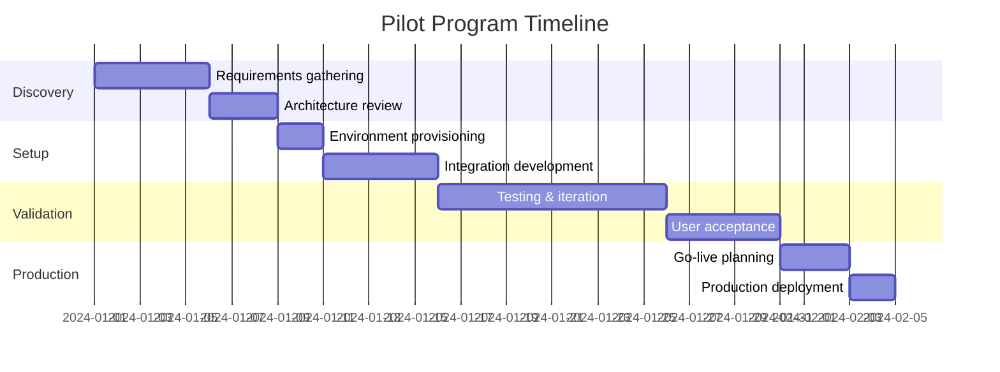

# Pilot Program

Get started with a structured pilot program to evaluate UAPK Gateway for your organization.

## Pilot Overview

Our pilot program provides:

- **Dedicated support** from our solutions team
- **Custom configuration** for your use case
- **Success metrics** to measure value
- **Clear timeline** to production

## Pilot Timeline

## Phase 1: Discovery (1 week)

### Requirements Gathering

- Identify AI agents to govern
- Define capability requirements
- Map approval workflows
- Document compliance needs

### Architecture Review

- Review existing infrastructure
- Plan integration points
- Define security requirements
- Design deployment topology

### Deliverables

- Requirements document
- Architecture diagram
- Integration plan
- Success criteria

## Phase 2: Setup (1-2 weeks)

### Environment Provisioning

- Provision UAPK Gateway instance
- Configure authentication
- Set up monitoring
- Deploy to staging

### Integration Development

- Integrate first agent
- Configure manifests
- Set up approval workflows
- Implement notifications

### Deliverables

- Working staging environment
- Integrated agent(s)
- Configured policies
- Test documentation

## Phase 3: Validation (2-3 weeks)

### Testing & Iteration

- Functional testing
- Performance testing
- Security review
- Policy refinement

### User Acceptance

- Operator training
- Workflow validation
- Documentation review
- Feedback incorporation

### Deliverables

- Test results
- Performance benchmarks
- Training materials
- Refined configuration

## Phase 4: Production (1 week)

### Go-Live Planning

- Production checklist
- Rollback procedures
- Monitoring setup
- Support handoff

### Production Deployment

- Deploy to production
- Migrate agents
- Enable monitoring
- Go live

### Deliverables

- Production deployment
- Runbook documentation
- Support transition
- Success report

## Success Criteria

| Metric | Target |
|--------|--------|
| Agent integration | All pilot agents integrated |
| Approval workflow | Configured and tested |
| Audit trail | Verified chain integrity |
| Latency | < 100ms p99 |
| Uptime | > 99.9% |
| User adoption | Operators trained |

## Pilot Scope

### Included

- Dedicated solutions engineer
- Weekly sync calls
- Custom configuration
- Integration support
- Training sessions
- Documentation

### Typical Pilot

- 2-5 AI agents
- 1-2 approval workflows
- 1 integration (e.g., Slack)
- 2-4 operators
- 4-6 week duration

## Pilot Pricing

| Component | Cost |
|-----------|------|
| Pilot program fee | $5,000 |
| Pro tier (during pilot) | Included |
| Solutions engineering | Included |
| Training | Included |

!!! info "Enterprise Commitment"
    Pilot fee is credited toward annual Enterprise contract.

## Application Process

### 1. Initial Conversation

Schedule a 30-minute call to discuss your requirements.

[Schedule Call](#){ .md-button .md-button--primary }

### 2. Technical Review

Our solutions team reviews your architecture and requirements.

### 3. Proposal

We provide a customized pilot plan and timeline.

### 4. Kickoff

Begin the pilot with a kickoff meeting.

## FAQ

??? question "What if the pilot isn't successful?"
    We work closely with you to ensure success. If the pilot doesn't meet objectives, there's no obligation to continue.

??? question "Can we extend the pilot?"
    Yes, pilots can be extended if additional time is needed to validate requirements.

??? question "What happens after the pilot?"
    Successful pilots transition to a production Enterprise contract with continued support.

??? question "Can we pilot with self-hosted deployment?"
    Yes, we support both cloud and self-hosted pilot deployments.

## Contact

Ready to start a pilot?

- Email: [pilots@uapk.dev](mailto:pilots@uapk.dev)
- Sales: [sales@uapk.dev](mailto:sales@uapk.dev)

[Apply for Pilot](#){ .md-button .md-button--primary }
[Contact Sales](mailto:sales@uapk.dev){ .md-button }

## Related

- [Pricing](pricing.md) - Plan details
- [Support](support.md) - Support options
- [Deployment](../deployment/index.md) - Technical deployment
