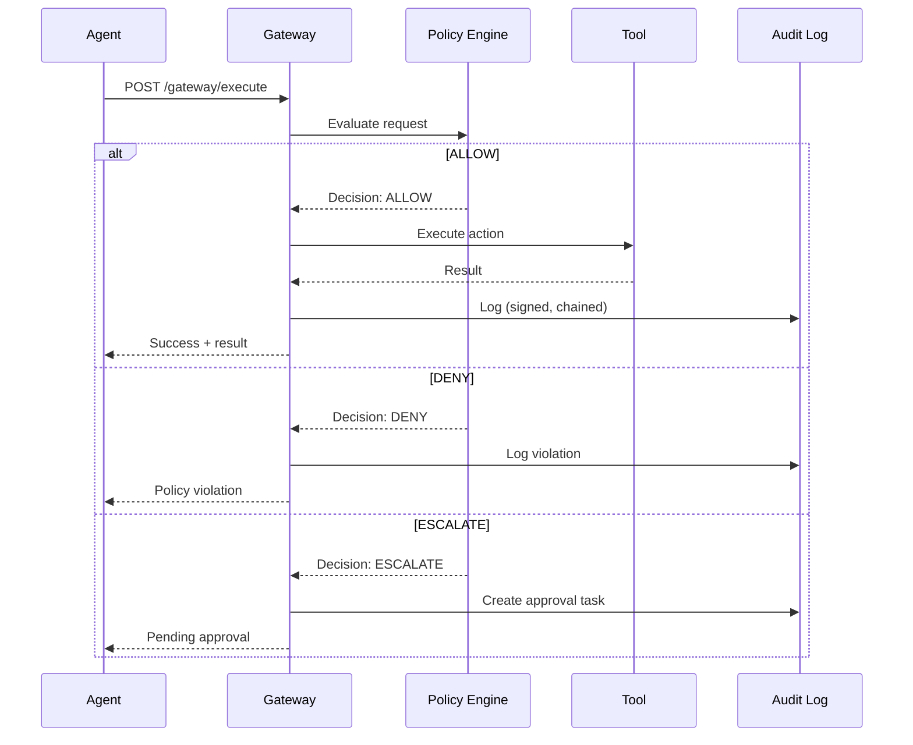

<style>
.md-content__button {
  display: none;
}
</style>

<div class="hero" markdown>
# UAPK Gateway

**Universal Agent Protocol Kit Gateway**

Policy enforcement, capability tokens, and tamper-evident audit logging for AI agents.

[Get Started :material-rocket-launch:](quickstart.md){ .md-button .md-button--primary }
[View on GitHub :material-github:](https://github.com/uapk/gateway){ .md-button }
</div>

## The Challenge

AI agents are increasingly capable of taking real-world actions: sending emails, making purchases, modifying files, calling APIs. But current architectures give agents direct access to tools with minimal oversight.

<div class="feature-grid" markdown>

<div class="feature-card" markdown>
### :material-shield-off: No Guardrails
Agents can exceed their intended scope with no policy enforcement at runtime.
</div>

<div class="feature-card" markdown>
### :material-file-hidden: No Audit Trail
Actions happen without tamper-evident logging, making compliance impossible.
</div>

<div class="feature-card" markdown>
### :material-currency-usd-off: No Budget Controls
Resource consumption goes unchecked, leading to runaway costs.
</div>

<div class="feature-card" markdown>
### :material-account-off: No Human Oversight
Critical actions happen without approval workflows.
</div>

</div>

## The Solution

UAPK Gateway acts as a **policy enforcement point** between AI agents and their tools. Instead of calling tools directly, agents submit action requests to the gateway, which validates, enforces, logs, and executes.



## Key Features

<div class="feature-grid" markdown>

<div class="feature-card" markdown>
### :material-shield-check: Policy Enforcement
Define rules for what actions are allowed, denied, or require approval. Enforce budgets, time windows, and jurisdictional constraints.
</div>

<div class="feature-card" markdown>
### :material-key-variant: Capability Tokens
Issue time-limited, scope-limited Ed25519-signed JWT tokens that grant specific permissions to agents.
</div>

<div class="feature-card" markdown>
### :material-file-sign: Tamper-Evident Logs
Every interaction is hash-chained and signed, creating an immutable audit trail that can be cryptographically verified.
</div>

<div class="feature-card" markdown>
### :material-account-check: Human-in-the-Loop
Configure approval workflows for sensitive actions. Operators review and approve/deny via dashboard or API.
</div>

<div class="feature-card" markdown>
### :material-office-building: Multi-Tenant
Organizations, teams, and agents with hierarchical policies. Full RBAC for operators.
</div>

<div class="feature-card" markdown>
### :material-chart-line: Real-Time Monitoring
Dashboard for operators to monitor agent activity, review approvals, and respond to incidents.
</div>

</div>

## Quick Start

```bash
# Clone and start
git clone https://github.com/uapk/gateway.git
cd uapk-gateway
make dev

# Set up database
make migrate
make bootstrap

# Open dashboard
open http://localhost:8000
```

See the [Quickstart Guide](quickstart.md) for complete instructions.

## Architecture

UAPK Gateway is designed to run on a single VM using Docker Compose:

| Component | Technology |
|-----------|------------|
| Backend | Python 3.12 + FastAPI |
| Database | PostgreSQL 16 |
| UI | Jinja2 + HTMX |
| Reverse Proxy | Caddy (production) |
| Signatures | Ed25519 |

See [Architecture Overview](concepts/index.md) for details.

## Core Concepts

| Concept | Description |
|---------|-------------|
| [**UAPK Manifest**](concepts/manifest.md) | JSON document declaring an agent's identity and requested capabilities |
| [**Capability Token**](concepts/capabilities.md) | Ed25519-signed JWT granting specific permissions to an agent |
| [**Policy Decision**](concepts/decisions.md) | ALLOW, DENY, or ESCALATE based on policy evaluation |
| [**Approval Workflow**](concepts/approvals.md) | Human review process for escalated actions |
| [**Audit Log**](concepts/logs.md) | Hash-chained, signed InteractionRecords for compliance |

## Status

**Version 0.1.0** - Core infrastructure complete.

- [x] Multi-tenant organizations and users
- [x] UAPK manifest validation
- [x] Capability token issuance (Ed25519 JWT)
- [x] Policy engine with ALLOW/DENY/ESCALATE
- [x] Approval workflow with UI
- [x] Tamper-evident audit logs with hash chaining
- [x] Operator dashboard

See the [Roadmap](roadmap.md) for planned features.

## License

Apache License 2.0 - See [LICENSE](https://github.com/uapk/gateway/blob/main/LICENSE) for details.

---

<div class="quick-links" markdown>
[:material-rocket-launch: Quickstart](quickstart.md)
[:material-book-open-variant: Concepts](concepts/index.md)
[:material-api: API Reference](api/index.md)
[:material-security: Security](security/index.md)
</div>
